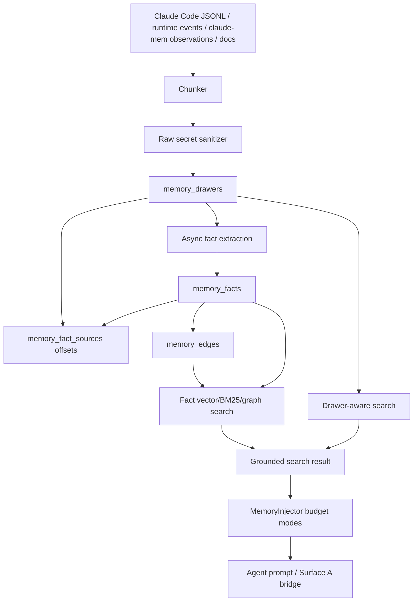
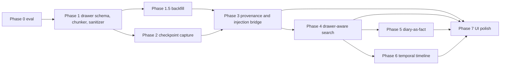
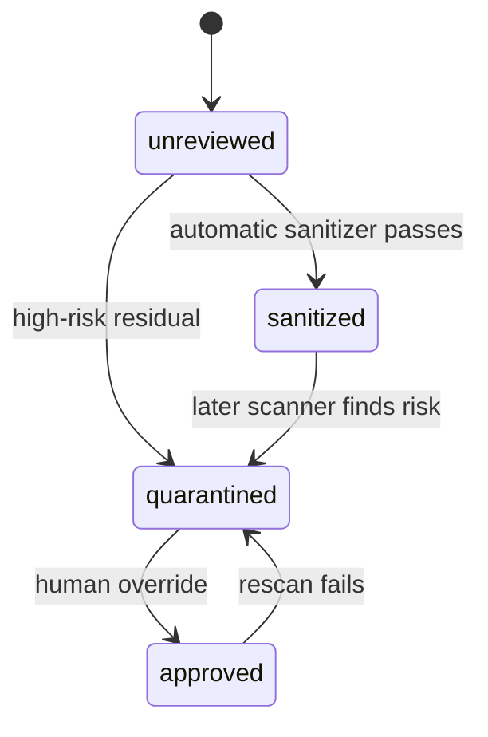

# MemPalace-Inspired Memory Evolution Implementation Plan

> **For Claude:** REQUIRED SUB-SKILL: Use superpowers:executing-plans to implement this plan task-by-task.

**Goal:** Upgrade AgentCTL memory from extracted fact recall into source-grounded, measurable, privacy-safe recall with verbatim evidence, bounded injection, temporal provenance, and recovery paths.

**Status sync (2026-04-20):** Phase 0 is in progress. PR #655 delivered the
deterministic eval foundation: fixture schema/sanitization, seed-42 split
helpers, mock scoring utilities for R@5/R@10/MRR/NDCG@10/grounding/drawer-hit
rate/p95, by-category/by-tag summaries, sanitized sample fixture, `pnpm
memory:eval`, and focused tests. PR #660 adds deterministic
mock recall@5 threshold enforcement, env-configurable bench sizing, p50/p95/p99
latency reporting, and `pnpm memory:bench` without live DB or embedding
dependencies. PR #667 locks first-run and `{ arguments: null }` MCP contracts
for the current search/recall/report routes. Live search wiring, future
`memory_dedup_check` / `memory_traverse` route contracts, and private/full
fixture coverage remain.

**Architecture:** Keep AgentCTL's PostgreSQL-native memory core instead of adopting ChromaDB. Add a sanitized verbatim drawer layer underneath existing `memory_facts`, link extracted facts back to source chunks through offsets, fuse drawer/fact/graph retrieval behind feature flags, and put eval, backfill, audit, injection budgets, and mesh compatibility gates before broad rollout.

**Tech Stack:** PostgreSQL + pgvector + tsvector, Fastify, existing `MemoryStore` / `MemorySearch` / `MemoryInjector`, worker MCP routes, Next.js memory UI, Vitest, fast-check, Playwright, existing audit logger, optional LiteLLM rerank behind a feature flag.

---

## Table of Contents

- [Review Corrections](#review-corrections)
- [Research Summary](#research-summary)
- [Glossary](#glossary)
- [Current AgentCTL Baseline](#current-agentctl-baseline)
- [Target Architecture](#target-architecture)
- [Design Principles](#design-principles)
- [Data Model Contract](#data-model-contract)
- [Chunking Specification](#chunking-specification)
- [Security, Audit, and Retention](#security-audit-and-retention)
- [Retrieval and Injection Plan](#retrieval-and-injection-plan)
- [Implementation Phases](#implementation-phases)
- [Suggested PR Slices](#suggested-pr-slices)
- [Risks and Guardrails](#risks-and-guardrails)
- [Out of Scope](#out-of-scope)
- [Acceptance Criteria](#acceptance-criteria)
- [First Implementation Choice](#first-implementation-choice)

## Review Corrections

This v1.3 plan supersedes the original PR #584 draft. It incorporates the review blockers before implementation starts:

- Migration numbers now start after the current latest migration, `0029_sync_nodes_reverse_registration_error_code.sql`. Use `0030`, `0031`, `0032`, and later numbers as listed below. If `main` advances before implementation, stop and update this plan instead of silently reusing occupied numbers.
- `wing` / `room` were removed from the schema. Existing `memory_scopes.scope` is the only durable hierarchy. `topic` is an optional room-like label.
- `content_sha256` is no longer unique. Use it for duplicate scanning only; `(source_type, source_id, chunk_index)` protects deterministic source-local idempotency.
- Drawer content, hash, snippets, and fact-source offsets are sanitized before storage. `memory_fact_sources` stores offsets, not copied quoted content.
- `memory_edges` changes explicitly require mesh sync review because `sync_capture_change()` serializes `to_jsonb(NEW)`.
- Embedding model/version stamping is first-class on drawers and facts.
- Token injection and Surface A (`MEMORY.md`) bridge are now separate required phases, not implied by retrieval work.
- Write-ahead audit for memory writes is tied to the existing `packages/agent-worker/src/hooks/audit-logger.ts` hash-chain logger instead of a new JSONL format.
- Backfill from Claude Code JSONL and `claude-mem` is explicit, so evals have real drawer data.
- Phase order is changed to build data before drawer-aware search: eval -> schema/chunker -> backfill -> checkpoint capture -> provenance/injection bridge -> search.
- Round-2 findings in [2026-04-15-mempalace-additional-findings.md](2026-04-15-mempalace-additional-findings.md) are folded into this plan: PreCompact timeout contract, query-hygiene gate, dev/held-out eval discipline, rank-bucket boosts, per-category reporting, entity canonicalization, shared redaction keys, and embedding rotation playbooks.
- Round-3 findings in [2026-04-16-mempalace-additional-findings-round-3.md](2026-04-16-mempalace-additional-findings-round-3.md) are folded into this plan: three-stage query sanitizer, empty-DB/cold-start contract, `memory_dedup_check`, `memory_traverse`, planted-needle recall bench, `sanitizeName()` validation, null-arguments MCP defenses, and explicit "do not steal" notes for MemPalace patterns that do not fit AgentCTL.

## Research Summary

MemPalace sources reviewed:

- [README](https://github.com/MemPalace/mempalace/blob/develop/README.md)
- [benchmarks/BENCHMARKS.md](https://github.com/MemPalace/mempalace/blob/develop/benchmarks/BENCHMARKS.md)
- [benchmarks/HYBRID_MODE.md](https://github.com/MemPalace/mempalace/blob/develop/benchmarks/HYBRID_MODE.md)
- [website/concepts/the-palace.md](https://github.com/MemPalace/mempalace/blob/develop/website/concepts/the-palace.md)
- [website/concepts/knowledge-graph.md](https://github.com/MemPalace/mempalace/blob/develop/website/concepts/knowledge-graph.md)
- [website/reference/mcp-tools.md](https://github.com/MemPalace/mempalace/blob/develop/website/reference/mcp-tools.md)
- [website/guide/hooks.md](https://github.com/MemPalace/mempalace/blob/develop/website/guide/hooks.md)
- [mempalace/searcher.py](https://github.com/MemPalace/mempalace/blob/develop/mempalace/searcher.py)
- [mempalace/backends/base.py](https://github.com/MemPalace/mempalace/blob/develop/mempalace/backends/base.py)
- [mempalace/knowledge_graph.py](https://github.com/MemPalace/mempalace/blob/develop/mempalace/knowledge_graph.py)

AgentCTL sources reviewed:

- `docs/LESSONS_LEARNED.md`
- `docs/plans/2026-03-10-unified-memory-layer-design.md`
- `docs/plans/2026-03-10-unified-memory-layer-impl-plan.md`
- `docs/plans/2026-03-11-claude-mem-migration-plan.md`
- `docs/plans/2026-03-11-memory-ui-design.md`
- `docs/plans/2026-03-11-memory-ui-implementation.md`
- `packages/control-plane/drizzle/0010_add_memory_layer.sql`
- `packages/control-plane/drizzle/0021_mesh_change_log.sql`
- `packages/control-plane/drizzle/0025_sync_nodes_peer_version.sql`
- `packages/control-plane/drizzle/0027_sync_nodes_schema_ahead_rejection.sql`
- `packages/control-plane/drizzle/0028_mesh_local_config.sql`
- `packages/control-plane/drizzle/0029_sync_nodes_reverse_registration_error_code.sql`
- `packages/control-plane/src/memory/memory-store.ts`
- `packages/control-plane/src/memory/memory-search.ts`
- `packages/control-plane/src/memory/memory-injector.ts`
- `packages/control-plane/src/memory/knowledge-synthesis.ts`
- `packages/control-plane/src/memory/knowledge-maintenance.ts`
- `packages/agent-worker/src/hooks/audit-logger.ts`
- `packages/agent-worker/src/hooks/experience-extraction-hook.ts`
- `packages/agent-worker/src/hooks/experience-extractor.ts`
- `packages/agent-worker/src/api/routes/memory-*.ts`
- `packages/shared/src/types/memory.ts`
- `docs/plans/2026-04-15-mempalace-additional-findings.md`
- `docs/plans/2026-04-16-mempalace-additional-findings-round-3.md`

## Glossary

| Term | AgentCTL meaning |
| --- | --- |
| Drawer | A sanitized raw memory chunk from a transcript, imported observation narrative, tool output, document, or diary entry. |
| Fact | Existing durable `memory_facts` row, extracted or manually written. |
| Fact source | A `memory_fact_sources` link from fact to drawer, stored as offsets into the sanitized drawer content. |
| Scope | Existing `global`, `project:*`, `agent:*`, or `session:*` visibility hierarchy. This replaces MemPalace wing semantics. |
| Topic | Optional room-like label on a drawer, derived from source context or user label. It is not a hierarchy. |
| Diary | A lightweight agent-scoped note represented as a fact with `is_diary = true`, not a separate table in the first implementation. |
| Surface A | Claude Code project memory file, e.g. `/Users/hahaschool/.claude/projects/-Users-hahaschool-agentctl/memory/MEMORY.md`, which is human-curated and currently injected in bulk. |
| Surface B | PostgreSQL memory: `memory_facts`, `memory_edges`, and the new drawer/provenance tables. |

## What MemPalace Gets Right

| Idea | MemPalace shape | AgentCTL status | Recommendation |
| --- | --- | --- | --- |
| Verbatim storage | Store original conversation text as drawers; extraction is not the source of truth. | AgentCTL stores extracted facts and summaries; raw transcript is not retained as first-class searchable memory. | Adopt, with stricter sanitizer and retention policy. |
| Scoped navigation | Wings for people/projects, rooms for topics, drawers for original chunks. | AgentCTL already has `memory_scopes`, entity types, tags, and graph edges. | Adapt to `scope` + optional `topic`; do not copy wing/room columns. |
| Hybrid retrieval | Raw semantic retrieval plus BM25, closet/source boosts, neighbor hydration, drawer-grep enrichment, temporal boosts, optional LLM rerank. | AgentCTL already has vector + BM25 + graph RRF over facts. | Adopt incrementally and keep every signal additive, never a hard gate. |
| Temporal KG | Entity triples with valid windows and timeline queries. | Facts have valid windows; edges do not. | Extend edges only after mesh sync compatibility is designed. |
| Agent diaries | Named agent wings with diary entries. | Agent scopes and `experience` facts exist. | Fold into `memory_facts` with `is_diary`, avoiding a fourth memory surface. |
| Auto-save hooks | Periodic save and PreCompact emergency save. | Post-session experience extraction exists, but no periodic raw checkpoint. | Adopt as nonblocking checkpoint capture. |
| Benchmarks | Benchmark methodology and per-question results. | No recall benchmark for AgentCTL memory quality. | Adopt before ranking changes, with internal plus external fixtures. |
| Backend abstraction | ChromaDB behind a narrow collection interface. | AgentCTL is intentionally PostgreSQL-native. | Keep Postgres; add test seams around retrieval services only. |
| AAAK compression | Experimental lossy token compression; round-2 research found upstream removal after eval regressions. | No equivalent. | Do not adopt. Revisit only if a future eval shows raw-storage token budget is the binding constraint. |

## Current AgentCTL Baseline

AgentCTL already has a strong memory system:

- `memory_facts` stores atomic facts with pgvector embeddings, tsvector, confidence, strength, scope, source metadata, and validity windows.
- `memory_edges` stores typed relations and is captured by mesh sync triggers.
- `MemorySearch` fuses vector, BM25, and graph results with Reciprocal Rank Fusion and boosts by recency, strength, scope, and role affinity.
- `MemoryInjector` supports pinned, on-demand, and triggered tiers but currently has one overall `maxTokens` budget and injects fact content only.
- Worker routes expose `memory_search`, `memory_store`, `memory_recall`, `memory_feedback`, `memory_report`, and `memory_promote`.
- Round-3 MCP comparison found MemPalace exposes 29 tools, but most are hierarchy CRUD endpoints that AgentCTL's `scope` model does not need. The useful gaps are `memory_dedup_check` and `memory_traverse`, not a wholesale MCP surface copy.
- Web UI covers browser, graph, dashboard, consolidation, reports, import, scopes, synthesis, maintenance, decay, provenance filters, and contextual session/agent/machine memory views.
- Post-session `ExperienceExtractor` mines decisions, patterns, errors, and experiences from completed transcripts.
- AgentCTL already has much stronger test and lifecycle infrastructure than MemPalace in several places: thousands of unit tests plus Playwright coverage, PG/LISTEN/NOTIFY-friendly mesh primitives instead of single-process inode polling, and `memory-decay` / `memory-consolidation` routes where upstream has no real pruning or GC answer.
- `MemoryObservation.narrative` from `claude-mem` migration is semantically closer to a drawer than a fact and must be handled that way in the new import path.
- `docs/LESSONS_LEARNED.md` explicitly warns that JSONL session files can be enormous, memory injection placement matters, and `claude-mem` code cannot be embedded because of AGPL.

The main gap is evidence preservation, bounded injection, and measured retrieval quality:

- Extracted facts can lose reasoning, alternatives, quotes, and local sequence.
- Search operates on extracted facts, so a missed extraction means the memory is gone from recall.
- The graph has relations between facts, but no raw source layer to prove why a fact exists.
- Surface A (`MEMORY.md`) and Surface B (PostgreSQL memory) can drift.
- Auto-capture happens after a session, not at periodic checkpoints or before compaction.
- There is no project-specific recall benchmark to prevent ranking changes from feeling good but hurting retrieval.

## Target Architecture





## Design Principles

1. Keep raw evidence searchable but sanitize before hashing, embedding, storage, logging, and display.
2. Treat summaries and extracted facts as indexes, not as the only memory.
3. Use existing `memory_scopes` as the only hierarchy. Do not introduce `wing` / `room` as a second source of truth.
4. Search should never gate on a weak classifier. Every advanced signal is an additive boost with a distance/score cap and a fallback to raw fact/drawer retrieval.
5. Every extracted fact should have provenance back to source chunks when available, but legacy facts without drawers must keep working.
6. Every ranking improvement needs an eval before and after.
7. Drawer storage needs stricter privacy controls than extracted facts: sanitizer, quarantine, retention, scoped visibility, audit, and explicit export/delete paths.
8. Injection and retrieval are separate. Drawer-aware search must not make prompt injection unbounded.
9. Mesh compatibility is part of schema design. New synced payload columns require schema-version review.
10. Search input hygiene is part of the retrieval contract. Embedding the full prompt, system prefix, or rendered conversation is a correctness bug.
11. Eval numbers are only meaningful with dev/held-out split discipline. Tune on dev; treat held-out as release evidence.
12. Do not add ChromaDB unless PostgreSQL cannot meet measured recall or latency goals. MemPalace's vector-store point-release breakage is an argument for staying PostgreSQL-native until data says otherwise.

## Data Model Contract

As of this plan, the latest migration on `main` is `0027_sync_nodes_schema_ahead_rejection.sql`. The first implementation PR must use the numbers below exactly after re-confirming `main` has not advanced. If `main` has advanced, update this plan in a small docs PR before writing migrations.

### `0030_add_memory_drawers.sql`

Raw source chunks, analogous to MemPalace drawers.

```sql
CREATE TABLE memory_drawers (
  id text PRIMARY KEY,
  scope text NOT NULL REFERENCES memory_scopes(scope) ON DELETE CASCADE,
  topic text NOT NULL DEFAULT 'general',
  source_type text NOT NULL CHECK (
    source_type IN (
      'session-jsonl',
      'runtime-checkpoint',
      'claude-mem-observation',
      'claude-mem-session-summary',
      'manual',
      'document',
      'diary'
    )
  ),
  source_id text NOT NULL,
  source_uri text,
  chunk_index integer NOT NULL DEFAULT 0,
  content text NOT NULL,
  content_sha256 text NOT NULL,
  embedding vector(1536),
  embedding_model text NOT NULL DEFAULT 'text-embedding-3-small',
  embedding_version integer NOT NULL DEFAULT 1,
  content_tsv_simple tsvector GENERATED ALWAYS AS (to_tsvector('simple', content)) STORED,
  token_count integer NOT NULL DEFAULT 0,
  source_json jsonb NOT NULL DEFAULT '{}',
  sync_visibility text NOT NULL DEFAULT 'local' CHECK (
    sync_visibility IN ('local', 'project', 'global')
  ),
  retention_expires_at timestamptz,
  archived_at timestamptz,
  redaction_status text NOT NULL DEFAULT 'unreviewed' CHECK (
    redaction_status IN ('unreviewed', 'sanitized', 'quarantined', 'approved')
  ),
  created_at timestamptz NOT NULL DEFAULT now(),
  updated_at timestamptz NOT NULL DEFAULT now(),
  UNIQUE (source_type, source_id, chunk_index)
);
```

Indexes:

```sql
CREATE INDEX idx_memory_drawers_embedding
  ON memory_drawers USING hnsw (embedding vector_cosine_ops)
  WITH (m = 32, ef_construction = 256);

CREATE INDEX idx_memory_drawers_content_tsv_simple
  ON memory_drawers USING gin (content_tsv_simple);

CREATE INDEX idx_memory_drawers_scope_topic
  ON memory_drawers(scope, topic);

CREATE INDEX idx_memory_drawers_source
  ON memory_drawers(source_type, source_id, chunk_index);

CREATE INDEX idx_memory_drawers_content_sha256
  ON memory_drawers(content_sha256);

CREATE INDEX idx_memory_drawers_retention
  ON memory_drawers(retention_expires_at)
  WHERE retention_expires_at IS NOT NULL AND archived_at IS NULL;
```

Notes:

- `content_sha256` is deliberately non-unique. Identical command output across sessions is legal.
- Hashes are computed after sanitization, never on raw secret-bearing input.
- Drawer IDs should use the existing short opaque project ID style, not long self-describing IDs. Store source details in `source_json`.
- `sync_visibility` is metadata only until mesh behavior is explicitly enabled.
- `content_tsv_simple` is chosen for mixed English/CJK data. Do not use cluster-default `websearch_to_tsquery`; pass the config explicitly.

### `0031_add_memory_fact_sources_and_versions.sql`

Many-to-many provenance from extracted facts to sanitized raw chunks.

```sql
ALTER TABLE memory_facts
  ADD COLUMN IF NOT EXISTS embedding_version integer NOT NULL DEFAULT 1,
  ADD COLUMN IF NOT EXISTS is_diary boolean NOT NULL DEFAULT false,
  ADD COLUMN IF NOT EXISTS draft boolean NOT NULL DEFAULT false;

CREATE TABLE memory_fact_sources (
  fact_id text NOT NULL REFERENCES memory_facts(id) ON DELETE CASCADE,
  drawer_id text NOT NULL REFERENCES memory_drawers(id) ON DELETE CASCADE,
  char_start integer,
  char_end integer,
  confidence real NOT NULL DEFAULT 1.0,
  created_at timestamptz NOT NULL DEFAULT now(),
  PRIMARY KEY (fact_id, drawer_id),
  CHECK (
    char_start IS NULL OR
    char_end IS NULL OR
    (char_start >= 0 AND char_end >= char_start)
  )
);

CREATE INDEX idx_memory_fact_sources_drawer
  ON memory_fact_sources(drawer_id, fact_id);

CREATE INDEX idx_memory_facts_embedding_version
  ON memory_facts(embedding_version);

CREATE INDEX idx_memory_facts_diary
  ON memory_facts(scope, is_diary, draft);
```

Notes:

- Do not store copied quoted content. Store offsets into sanitized drawer content and produce quote previews at read time.
- `is_diary` folds agent diaries into the existing fact table. Default search excludes diary rows unless requested.
- `draft` allows non-durable notes without a separate diary table.

### `0032_add_memory_drawer_audit_and_backfill_state.sql`

Support backfill recovery and audit correlation.

```sql
CREATE TABLE memory_drawer_backfill_state (
  id text PRIMARY KEY,
  source_type text NOT NULL,
  source_root text NOT NULL,
  cursor_json jsonb NOT NULL DEFAULT '{}',
  status text NOT NULL CHECK (status IN ('running', 'paused', 'complete', 'failed')),
  last_error text,
  created_at timestamptz NOT NULL DEFAULT now(),
  updated_at timestamptz NOT NULL DEFAULT now()
);
```

Memory write audit entries should be emitted through `AuditLogger` as a new `kind: 'memory_write'` variant with `sessionId`, `agentId`, `machineId` where applicable, `drawerId`, `sourceType`, `scope`, `chunkIndex`, `contentHash`, `redactionStatus`, and `success`. Do not log raw content.

### `0033_add_memory_edge_temporal_fields.sql`

Only create this migration after the mesh sync contract is reviewed.

```sql
ALTER TABLE memory_edges
  ADD COLUMN IF NOT EXISTS valid_from timestamptz,
  ADD COLUMN IF NOT EXISTS valid_until timestamptz,
  ADD COLUMN IF NOT EXISTS source_drawer_id text REFERENCES memory_drawers(id),
  ADD COLUMN IF NOT EXISTS confidence real NOT NULL DEFAULT 1.0;
```

Mesh gate before merging this migration:

1. Review `packages/control-plane/drizzle/0021_mesh_change_log.sql`. `sync_capture_change()` currently uses `to_jsonb(NEW)`, so new columns enter the sync payload.
2. Decide whether new edge fields are synced. If yes, bump the mesh schema version and use the compatibility flow introduced by `0025_sync_nodes_peer_version.sql` and `0027_sync_nodes_schema_ahead_rejection.sql`.
3. If no, add an explicit sync payload projection or excluded-column mechanism. Do not rely on whole-row serialization.
4. Add tests for old peer behavior and schema-ahead rejection before enabling edge timeline sync.

## Chunking Specification

Chunking is part of the storage contract. Two agents must not implement incompatible chunkers.

Constants:

| Setting | Value |
| --- | --- |
| `chunk_target_chars` | 1,200 |
| `chunk_min_chars` | 300, except final chunk |
| `chunk_max_chars` | 2,000 |
| `overlap_chars` | 160 |
| `max_tool_output_chars_per_turn` | 8,000 before summarizing or splitting |
| `max_checkpoint_chars` | 40,000 per checkpoint event |

Boundary priority:

1. Message/turn boundary.
2. Markdown heading.
3. Paragraph blank line.
4. List item boundary.
5. Sentence boundary.
6. Whitespace boundary.
7. Hard character split at `chunk_max_chars`.

Atomic block rules:

- Do not split inside fenced code blocks unless a single code block exceeds `chunk_max_chars`; in that case split on line boundaries and mark `source_json.atomic_split = true`.
- Do not split JSON objects or tool-call envelopes when they fit under `chunk_max_chars`.
- Split very long grep/diff/tool output on file hunk or line boundaries.
- Exclude model thinking/private chain-of-thought blocks. Store only user, assistant-visible, tool input/output, command summaries, and explicitly approved diary/manual content.
- Preserve source order with monotonic `chunk_index`.

Required chunker tests:

- Round-trip: chunk content concatenation with overlaps removed equals normalized sanitized input.
- Monotonicity: `chunk_index` strictly increases per `(source_type, source_id)`.
- Boundary invariant: no chunk crosses a fenced code block that fits under `chunk_max_chars`.
- Size invariant: every non-final chunk is between `chunk_min_chars` and `chunk_max_chars`.
- Determinism: same sanitized source produces same chunk sequence.
- Sanitizer-before-hash: raw secret variants produce redacted content hashes, not raw secret hashes.

## Security, Audit, and Retention

### Raw Transcript Sanitizer

Phase 1 must create a drawer-specific sanitizer rather than reusing fact-level sanitization blindly.

Create a shared redaction module:

- Create: `packages/shared/src/memory/redaction.ts`
- Export: `MEMORY_REDACT_KEYS`
- Export: `redactKeys<T extends object>(obj: T, keys = MEMORY_REDACT_KEYS): T`

Default key list:

```typescript
export const MEMORY_REDACT_KEYS: ReadonlySet<string> = new Set([
  'api_key',
  'apikey',
  'password',
  'token',
  'authorization',
  'secret',
  'openai_api_key',
  'anthropic_api_key',
  'aws_secret_access_key',
  'bearer',
  'cookie',
  'x-api-key',
  'stripe_api_key',
  'slack_webhook_url',
]);
```

The raw-transcript sanitizer, `AuditLogger` memory write path, checkpoint metadata logs, and future memory audit surfaces must call `redactKeys()` before writing structured context. Add a Vitest suite that covers the helper and greps memory audit call sites to ensure the helper is on the write path.

Create a shared name-field validator:

- Create: `packages/shared/src/memory/validation.ts`
- Export: `MEMORY_NAME_MAX_LENGTH = 128`
- Export: `sanitizeName(name: string): string`
- Reject `..`, NUL bytes, control characters, and path separators that would become path traversal if scope/entity names are later used for export paths.
- Apply to `memory_facts.entity_name`, `memory_facts.scope`, `memory_edges.subject_name`, `memory_edges.object_name`, and `memory_drawers.scope` on insert/update.

Minimum patterns:

- OpenAI/Anthropic style keys: `sk-*`, `sk-ant-*`
- GitHub tokens: `ghp_*`, `github_pat_*`
- Bearer tokens: `Authorization: Bearer ...`
- JWT-like values beginning with `eyJ`
- Database URLs: `postgres://`, `postgresql://`, `redis://`, `mysql://`
- Cookie/session headers: `Cookie:`, `Set-Cookie:`, `session=`
- `.env` shaped assignments where key contains `KEY`, `SECRET`, `TOKEN`, `PASSWORD`, `COOKIE`, `DSN`, `DATABASE_URL`, `REDIS_URL`
- Private keys: `BEGIN * PRIVATE KEY`

Sanitizer order:

1. Normalize line endings and strip thinking/private blocks.
2. Redact secrets.
3. Assign `redaction_status`:
   - `sanitized`: redactions occurred and no quarantine pattern remains.
   - `quarantined`: high-risk pattern remains or sanitizer cannot parse safely.
   - `approved`: human override after review.
   - `unreviewed`: transient ingest state only; search must not return it.
4. Compute `content_sha256` on sanitized content.
5. Embed sanitized content only.
6. Audit write without raw content.



Search default:

```sql
WHERE redaction_status IN ('sanitized', 'approved')
  AND archived_at IS NULL
```

### Retention

Default retention:

| Scope | Drawer retention | Notes |
| --- | --- | --- |
| `session:*` | 90 days | Raw session chunks are high volume and machine-local by default. |
| `agent:*` | 180 days | Diary/draft continuity is useful but not permanent by default. |
| `project:*` | unlimited until archived | Project decisions and implementation evidence are durable. |
| `global` | unlimited until archived | Only approved/sanitized high-value knowledge should reach global. |

Storage estimate for active local use:

- 30 sessions/day, 15 turns/session, 6-10 drawers/session.
- 7,200-9,000 drawers/month.
- Approx 2 KB sanitized content + 6 KB vector/index overhead per drawer.
- Roughly 60-75 MB/month/user before index bloat and archive overhead.

Required maintenance:

- `pnpm memory:drawers:vacuum`: archives expired drawers and leaves facts intact.
- Archive design must be decided before volume grows: either `memory_drawers_archive` in Postgres or local/S3 blob storage keyed by drawer ID.
- If a fact references an archived drawer, UI shows archived provenance with restore action or unavailable marker.

### Mesh Sync Policy

Drawer sync must be decided in Phase 1, before adding any sync trigger.

Initial policy:

- `session:*`: `sync_visibility = 'local'`, not synced.
- `agent:*`: `sync_visibility = 'local'` unless the agent profile is explicitly cross-machine.
- `project:*`: eligible for sync after sanitization and explicit feature flag.
- `global`: eligible for sync only after `approved` or `sanitized`.

If facts sync but drawers do not, fact-source links can point to missing drawers on peer machines. UI and APIs must represent this as `sourceUnavailable: true`, not as a broken request.

## Retrieval and Injection Plan

### Embedding Version Contract

Add constants:

- `CURRENT_MEMORY_EMBEDDING_MODEL = 'text-embedding-3-small'`
- `CURRENT_MEMORY_EMBEDDING_VERSION = 1`

Suggested file:

- Create: `packages/shared/src/memory/constants.ts`
- Export through `packages/shared/src/index.ts`

Rules:

- `memory_facts.embedding_version` and `memory_drawers.embedding_version` must match the current version for vector search.
- Search filters stale vectors out of vector paths but can still use keyword/graph paths.
- `pnpm memory:reembed --from-version <n> --to-version <m>` handles batch rebuild.
- Bumping embedding versions requires a migration default change plus a background re-embed plan.
- Embedding rotation playbook:
  1. Write new rows under the new `embedding_model` / `embedding_version`.
  2. Build a second HNSW index filtered to the new model/version if mixed versions must coexist.
  3. Dual-query during transition and union/dedup by fact or drawer ID.
  4. Remove old embeddings only after held-out eval matches or beats the prior baseline.
  5. Never mix incompatible embedding models in one ranking pool without model/version filtering.

### Baseline Search Paths

Keep current fact paths:

- fact vector search
- fact BM25 search
- fact graph search

Add drawer paths:

- drawer vector search
- drawer keyword search with explicit `websearch_to_tsquery('simple', $query)` or equivalent fallback.
- drawer-grep enrichment within matched source: after a vector hit identifies a source, grep/rank sibling chunks from that same source for exact noun overlap.
- source-neighbor hydration: fetch `chunk_index - 1`, current, and `chunk_index + 1` in one batched query, within budget.

Implementation notes:

- Avoid N+1 neighbor queries. Use one query joining hits to drawers by `source_type`, `source_id`, and chunk range.
- Set HNSW query parameters deliberately for drawer scale. Start with index `m = 32`, `ef_construction = 256`; benchmark `hnsw.ef_search` values before defaulting drawer search on.
- Batch embeddings for backfill and checkpoint ingestion with `input: string[]`; do not call the embedding API once per drawer during bulk work.

### Ranking Signals

Every signal is additive and capped. No signal may hide raw drawer hits or demote legacy fact-only hits below a fixed penalty gate.

Boost application is rank-bucket based, not distance-multiplied. For each additive signal:

1. Run the fused base ranker.
2. Take the top-K candidates satisfying the signal.
3. Add fixed rank-position boosts from `MEMORY_RANK_BOOSTS`, default `[0.40, 0.25, 0.15, 0.08, 0.04]`.
4. Re-sort.

Do not multiply boosts into `1 - cosine_distance`, and do not scale boosts by raw vector score. Rank-bucket boosts are more stable across embedding-model rotation.

Feature flags:

- `MEMORY_DRAWER_SEARCH_ENABLED`
- `MEMORY_DRAWER_GREP_ENABLED`
- `MEMORY_TEMPORAL_BOOST_ENABLED`
- `MEMORY_ASSISTANT_REFERENCE_SEARCH_ENABLED`
- `MEMORY_RERANK_ENABLED`

Signals:

1. Exact keyword / BM25 fallback.
2. Drawer-grep enrichment within matched source.
3. Source-neighbor hydration.
4. Fact-source boost, capped and additive.
5. Assistant-reference two-pass for queries like "you suggested" or "Codex recommended".
6. Basic temporal boost only for relative dates supported by `chrono-node` or deterministic parsing: "yesterday", "last week", "four weeks ago".
7. Event-anchored temporal queries such as "before PR #563" and "after the mesh migration" are Phase 4b and depend on a stable event log or GitHub metadata source.
8. Optional LLM rerank only after top-20 retrieval, behind `MEMORY_RERANK_ENABLED`.

### Query Hygiene

Query hygiene is part of the search contract, not a downstream caller concern.

Implement a shared sanitizer in `packages/shared/src/memory/query-sanitizer.ts`. Both `packages/agent-worker/src/api/routes/memory-search.ts` and `packages/control-plane/src/memory/memory-search.ts` must call `sanitizeQuery()` before embedding; neither surface trusts the other.

Three-stage pipeline:

1. Passthrough:
   - If `query.length <= MEMORY_QUERY_MAX_CHARS` and no role markers, system-prompt smell, code-fence prefix, or rendered conversation separators are present, pass through unchanged except trimming.
2. Question extraction:
   - If the input is contaminated but contains a trailing question sentence, take the minimal suffix ending in `?`.
   - Multi-question inputs use the last question. This mirrors the common "long wake-up prompt + actual user question" failure mode.
3. Tail-sentence fallback:
   - If no `?` exists, split on `/[.!?]\s+/` and take the last sentence bounded by `MEMORY_QUERY_MAX_CHARS`.
   - If the fallback remains too long, hard-truncate with a warning log instead of embedding the full contaminated prompt.

Defaults and logs:

- `MEMORY_QUERY_MAX_CHARS` default: `250`.
- Log `query.sanitizer_stage` as one of `passthrough`, `question_extracted`, `tail_fallback`, `truncated`, or `empty`.
- Log `query.has_prefix_smell`, `query.original_chars`, and `query.sanitized_chars` for every search.
- Alert if more than `MEMORY_SANITIZER_FALLBACK_WARN_RATIO` of searches fall into `tail_fallback` or `truncated`; default ratio is `0.05`.
- Empty or whitespace-only inputs return `400 query_empty` after sanitizer, never an embedding call.

Required contamination tests:

- Mirror MemPalace's 14 query-sanitizer pollution vectors before Phase 4 can ship.
- Include at minimum: 2,000-char system prompt prefix plus one question, role-tagged conversation dump, code fence plus question, multi-question query where the last question wins, no-question tail fallback, empty input, and whitespace-only input.
- Prepend every eval fixture query with a 2,000-token harmless prefix and assert NDCG@10 drops by less than 5 points.
- If the drop exceeds 5 points, retrieval is input-contaminated and Phase 4 cannot ship.

### Result Shape

Use a discriminated union, not optional `fact?` / `drawer?` combinations.

```typescript
type DrawerSnippet = {
  drawerId: string;
  sourceType: string;
  sourceId: string;
  chunkIndex: number;
  snippet: string;
  charStart: number | null;
  charEnd: number | null;
  sourceUnavailable?: boolean;
};

type GroundedMemorySearchResult =
  | {
      kind: 'fact';
      fact: MemoryFact;
      supportingDrawers: DrawerSnippet[];
      score: number;
      sourcePath: Array<'fact-vector' | 'fact-bm25' | 'fact-graph' | 'source-boost'>;
      tokenEstimate: number;
    }
  | {
      kind: 'drawer';
      drawer: DrawerSnippet;
      score: number;
      sourcePath: Array<'drawer-vector' | 'drawer-keyword' | 'drawer-grep' | 'temporal'>;
      tokenEstimate: number;
    }
  | {
      kind: 'diary';
      fact: MemoryFact;
      score: number;
      tokenEstimate: number;
    }
  | {
      kind: 'timeline';
      events: TimelineEvent[];
      score: number;
      tokenEstimate: number;
    };
```

### Injection Budget

Drawer-aware search cannot directly inject all snippets.

Add budget modes:

- `fact-only`: current behavior. No drawer snippets.
- `fact-plus-snippet`: fact plus top-1 snippet capped at 120-240 chars.
- `full-drawer`: on-demand only, explicit tool/user request, capped by per-tier budget.

Extend `InjectionBudget`:

```typescript
type InjectionBudget = {
  maxTokens: number;
  maxFacts: number;
  tiers: readonly InjectionTier[];
  pinnedCap: number;
  tierTokenCaps: {
    pinned: number;
    onDemand: number;
    triggered: number;
    evidence: number;
  };
  resultMode: 'fact-only' | 'fact-plus-snippet' | 'full-drawer';
};
```

Default proposal:

- L0 identity/cardinal rules: 100-150 tokens, static and cacheable.
- L1 essential project facts: 500-800 tokens, online PG facts, no raw drawers.
- L2 on-demand evidence: 800-1,200 tokens, top facts plus top-1 snippets.
- L3 deep search: explicit tool route returning drawer details outside default prompt injection.

Surface A bridge:

- `MEMORY.md` should become L0 plus a compact generated L1 section, not a full 5.6 KB always-on blob.
- Create a generator that reads reviewed Surface B facts and writes a bounded Surface A summary.
- Do not auto-edit human-curated lines without a dry-run diff and approval flow.

Mobile constraint:

- Mobile memory views should show fact plus top-1 evidence snippet truncated to 120 chars. Full drawer content opens in a separate detail panel.

## Implementation Phases

### Phase 0: Eval Harness First

**Goal:** Make retrieval quality measurable before ranking changes.

**Status:** In progress. PR #655 delivered the fixture schema, deterministic
split helpers, scoring utilities, sanitized sample fixture, and baseline CLI.
PR #660 adds a deterministic mock PR bench with threshold
enforcement and latency percentiles, and PR #667 locks first-run /
`{ arguments: null }` contracts for the current worker memory MCP routes. The
remaining Phase 0 work is live-search wiring, future `memory_dedup_check` /
`memory_traverse` route contracts, private fixture growth, and release/weekly
held-out automation.

**Files:**

- Create: `packages/control-plane/src/memory/memory-eval.ts`
- Create: `packages/control-plane/src/memory/memory-eval.test.ts`
- Create: `packages/control-plane/src/memory/memory-eval.fixture.test.ts`
- Add: planted-needle bench helpers in `packages/control-plane/src/memory/memory-eval.ts`
- Create: `packages/agent-worker/src/api/routes/__tests__/memory-cold-start.test.ts`
- Create: `docs/fixtures/memory-eval/agentctl-memory-eval.sample.json`
- Add: `scripts/memory-eval.ts`
- Add: `scripts/memory-bench.ts`
- Modify: `package.json`

**Work:**

1. Define eval fixture schema with query, expected facts, expected drawer sources, redacted answer hints, tags, and public/private marker.
2. Commit only a sanitized sample fixture. Store the real 30-50 internal fixture in a gitignored path such as `tmp/memory-eval/agentctl-private.json`.
3. Add at least one external anchor set from LongMemEval-style single-session preference or project-memory cases, converted into sanitized local fixture format.
4. Add deterministic split discipline:
   - `EVAL_SPLIT_SEED = 42`
   - 10% dev / 90% held-out
   - tuning PRs use dev only
   - held-out runs only on release tags and weekly cron
   - held-out rows are immutable after the first tag; bad rows use `excluded: true` plus `fixtures/CHANGELOG.md`, not deletion or silent expected-answer edits.
5. Add API helpers:
   - `getDevSet(): Fixture[]`
   - `getHeldOutSet(): Fixture[]`
   - `getFullSet(): Fixture[]`, callable only by release-eval jobs.
6. Metrics: R@5, R@10, MRR, NDCG@10, drawer-only hit rate, source-grounding coverage, p95 search duration, and per-category R@5/R@10/NDCG@10.
7. Categories:
   - LongMemEval-compatible categories where applicable.
   - `AgentCTL-internal` for project-specific memory shapes.
   - Failure-mode tags for vocabulary gap, temporal ambiguity, assistant-reference, person-name underweighting, and noisy distractor rejection.
8. Required fixture coverage:
   - At least 5 rows for each failure-mode tag.
   - At least 5 assistant-turn queries.
   - At least 5 relative-time queries.
9. Baseline progression targets:
   - raw vector only: R@10 >= 90%
   - hybrid vector + BM25 + boosts: R@10 >= 95%
   - hybrid + LLM rerank: R@10 >= 98%
   - misses are plan-level findings requiring issues, not silent retuning.
10. Held-out regression budget: >2 point NDCG@10 drop between release evals is a release blocker.
11. CI uses deterministic mock embeddings to verify retrieval logic. Nightly or local eval uses real embeddings against dev-1/dev-2 configuration.
12. Baseline numbers must be written into this plan or a follow-up eval report before Phase 4 defaults can change.
13. Add planted-needle PR regression bench:
   - ✅ Generate `MEMORY_BENCH_NEEDLE_COUNT` synthetic public fixture rows with `NEEDLE_` expected fact ids; default count is 100.
   - ✅ Generate `MEMORY_BENCH_NOISE_COUNT` deterministic mock distractors; default count is 2,000.
   - ✅ Query each needle without the `NEEDLE_` prefix in the synthetic row query.
   - ✅ Block the PR if recall@5 falls below `MEMORY_BENCH_MIN_RECALL`; default is `0.85`.
   - ✅ Report p50, p95, and p99 search latency.
   - Remaining: wire the same bench shape to live search once the drawer/search path exists.
   - Remaining: run larger N={100,1000,5000} curves on release tags, not on every PR.
14. Add empty-DB contract matrix before any new route ships:
   - ✅ Current worker route slice: `memory_search` returns `{ results: [], total: 0 }` while preserving `facts`.
   - ✅ Current worker route slice: `memory_recall` returns `{ facts: [], edges: [] }`.
   - ✅ Current worker route slice: `memory_report` / stats route returns zero counts, not nulls.
   - `memory_traverse` for a missing entity returns an empty graph, not `404`.
   - `memory_dedup_check` on an empty DB recommends `store_new` with `nearest_matches: []`.
   - ✅ Current worker route slice: every existing memory MCP route rejects `{ arguments: null }` without hanging and returns a structured `400` within one second.
   - Remaining: add matching cold-start/null-arguments coverage for `memory_dedup_check` and `memory_traverse` when those planned routes exist.

**Tests:**

- Fixture schema rejects raw-looking secrets and non-redacted internal IDs.
- Mock embedding path is deterministic.
- R@5/MRR/NDCG calculations are correct.
- Private fixture path is ignored by git.
- Split generation is deterministic for seed 42.
- A test asserts fixture failure-mode coverage.
- Per-category report output is stable markdown.
- Contaminated-query eval fixture path exists for Phase 4.
- Planted-needle bench enforces recall@5 threshold on mock embeddings.
- Existing worker memory MCP routes return structured empty results for search, recall, and report.
- Existing worker memory MCP routes reject null `arguments`; planned `memory_dedup_check` / `memory_traverse` get matching tests when implemented.

**Rollback:** No product behavior change.

### Phase 1: Drawer Schema, Chunker, Sanitizer, Audit

**Goal:** Preserve sanitized raw evidence without replacing existing facts.

**Status:** Partially delivered in PRs #671 and #679. PR #671 added `0030_add_memory_drawers.sql`, Drizzle schema/journal/schema tests, shared memory constants/redaction/validation, drawer types, deterministic chunking, red-team sanitizer coverage, and `MemoryDrawerStore` tests for sanitized hash/embed/store behavior. PR #679 added the shared redacted `memory_write` audit entry builder, audit logger/reporter support, and `MemoryDrawerStore` success/failure audit emission without raw drawer content. Remaining Phase 1.5 scope is resumable JSONL/claude-mem backfill plus persisted backfill state; drawers still have no sync triggers and no default retrieval behavior.

**Files:**

- Create: `packages/control-plane/drizzle/0030_add_memory_drawers.sql`
- Modify: `packages/control-plane/drizzle/meta/_journal.json`
- Modify: `packages/control-plane/src/db/schema.ts`
- Modify: `packages/control-plane/src/db/schema.test.ts`
- Modify: `packages/shared/src/types/memory.ts`
- Create: `packages/shared/src/memory/constants.ts`
- Create: `packages/shared/src/memory/validation.ts`
- Create: `packages/shared/src/memory/validation.test.ts`
- Create: `packages/control-plane/src/memory/memory-drawer-types.ts`
- Create: `packages/control-plane/src/memory/memory-drawer-chunker.ts`
- Create: `packages/control-plane/src/memory/memory-drawer-sanitizer.ts`
- Create: `packages/control-plane/src/memory/memory-drawer-store.ts`
- Create: `packages/control-plane/src/memory/memory-drawer-store.test.ts`
- Create: `packages/control-plane/src/memory/memory-drawer-chunker.test.ts`
- Create: `packages/control-plane/src/memory/memory-drawer-sanitizer.test.ts`
- Modify: `packages/agent-worker/src/hooks/audit-logger.ts`
- Modify: `packages/agent-worker/src/hooks/audit-logger.test.ts`
- Modify: `packages/agent-worker/src/hooks/audit-reporter.ts`
- Modify: `packages/agent-worker/src/hooks/audit-reporter.test.ts`
- Create: `packages/shared/src/memory/audit.ts`
- Create: `packages/shared/src/memory/audit.test.ts`
- Modify: `packages/control-plane/src/memory/index.ts`

**Work:**

1. Add `memory_drawers` exactly as specified in `0030_add_memory_drawers.sql`.
2. Add the shared embedding constants and explicit drawer types.
3. Implement the chunker with the constants in [Chunking Specification](#chunking-specification).
4. Implement raw-transcript sanitizer and quarantine logic.
5. Store only sanitized content, sanitized hash, and sanitized embeddings.
6. Add memory write audit entry kind to existing `AuditLogger`. *(Delivered in PR #679.)*
7. Apply `sanitizeName()` to scope/entity fields before drawer/fact/edge writes.
8. Do not add sync triggers for drawers in this phase.

**Tests:**

- Red-team sanitizer covers API keys, Bearer tokens, GitHub tokens, JWTs, DB URLs, cookies, env assignments, and private keys.
- Name validator caps names at 128 chars and rejects `..`, NUL bytes, control characters, and path-traversal separators.
- Sanitizer runs before hash and embedding.
- Quarantined drawers are not searchable by default.
- Duplicate `content_sha256` across different sources is legal.
- Duplicate `(source_type, source_id, chunk_index)` is skipped/upserted idempotently.
- Memory write audit entries strip raw content-like metadata keys, redact sensitive keys, and summarize failures without logging raw drawer content.
- Chunker property tests cover round-trip, boundaries, determinism, and size invariants.
- Audit entry writes hashed metadata without raw content.

**Rollback:** Disable drawer writes with `MEMORY_DRAWERS_WRITE_ENABLED=false`; schema remains.

### Phase 1.5: Backfill and Cold Start

**Goal:** Create enough drawer data for search evals and provenance without waiting months.

**Files:**

- Create: `packages/control-plane/drizzle/0032_add_memory_drawer_audit_and_backfill_state.sql`
- Create: `scripts/backfill-memory-drawers.ts`
- Create: `scripts/backfill-memory-drawers.test.ts`
- Modify: `scripts/import-claude-history.ts`
- Modify: `scripts/import-claude-mem-to-pg.ts`
- Modify: `scripts/claude-mem-migration-lib.ts`
- Modify: `docs/plans/2026-03-11-claude-mem-migration-plan.md`

**Work:**

1. Backfill from Claude Code JSONL under `~/.claude/projects/**`.
2. Backfill `claude-mem` observations:
   - `narrative` becomes drawer content.
   - `title` and atomic `facts` remain `memory_facts`.
   - `memory_fact_sources` links imported facts to narrative drawers when both exist.
3. Add resumable state in `memory_drawer_backfill_state`.
4. Batch embedding calls and rate-limit with exponential backoff.
5. Make the script idempotent through `(source_type, source_id, chunk_index)`.
6. Add dry-run mode with counts, estimated tokens, estimated cost, and estimated storage.

**Tests:**

- Stream-parses large JSONL; does not `JSON.parse(readFileSync())`.
- Resumes from checkpoint after simulated crash.
- Deduplicates source-local chunks.
- Does not write private fixtures or raw secrets.
- `claude-mem` narrative maps to drawer while facts map to facts.

**Rollback:** Pause the backfill state and run `pnpm memory:drawers:vacuum --source <id>` for failed source batches.

### Phase 2: Nonblocking Checkpoint Capture

**Goal:** Reduce memory loss from long-running sessions and context compaction.

**Files:**

- Create: `packages/agent-worker/src/hooks/memory-checkpoint-hook.ts`
- Create: `packages/agent-worker/src/hooks/memory-checkpoint-hook.test.ts`
- Modify: `packages/agent-worker/src/runtime/sdk-runner.ts`
- Modify: `packages/agent-worker/src/runtime/agent-instance.ts`
- Modify: `packages/agent-worker/src/hooks/index.ts`
- Add docs: `docs/MEMORY_CHECKPOINTS.md`

**Work:**

1. Add nonblocking checkpoint hook triggered by every N human turns, stop/session end, and pre-compaction when runtime exposes it.
2. Default cadence is every 15 user messages via `MEMORY_CHECKPOINT_MESSAGE_INTERVAL=15`.
3. All `SessionStart`, `Stop`, and `PreCompact` memory hooks must return within `MEMORY_HOOK_TIMEOUT_MS`, default `2000`.
4. Never await a DB write inside a hook. Drawer captures enqueue onto the same queue-backed path used by backfill; the hook returns with a job ID or a structured deferred result.
5. Use an `AbortSignal` wired to the hook timeout. On abort, increment `memory_checkpoint_hook_timeout_total` and return without blocking the session.
6. Losing a checkpoint is a warning; blocking PreCompact is a paging-severity defect. Prefer dropping/deferring memory work over blocking compaction or user execution.
7. Store drawer chunks first; enqueue extraction separately.
8. Use a BullMQ or existing queue-backed worker for `memory-drawer-extraction`. If no queue is available in the target environment, explicitly implement inline best-effort mode and document the tradeoff.
9. Make extraction idempotent per drawer: check `memory_fact_sources` for existing links or use deterministic source keys before creating facts.
10. Add orphan drawer recovery: scheduled job scans drawers with no extraction attempt and re-enqueues them.
11. Chaos behavior: if PG, queue, or embedding API fails, the agent run continues.

**Config:**

- `MEMORY_CHECKPOINT_ENABLED`
- `MEMORY_CHECKPOINT_MESSAGE_INTERVAL`
- `MEMORY_CHECKPOINT_MAX_CHARS`
- `MEMORY_DRAWER_EXTRACTION_QUEUE_ENABLED`
- `MEMORY_HOOK_TIMEOUT_MS`

**Tests:**

- Under interval does nothing.
- At interval stores drawer chunks.
- Repeated hook does not duplicate the same transcript chunk.
- Extraction failure does not lose raw drawer.
- Hook errors do not block session teardown.
- Simulated PG/embedding 500 keeps runtime successful.
- Fixture stalls the drawer queue worker for 30 seconds; PreCompact hook returns within 2.5 seconds.
- Stalled queue test eventually lands one drawer after the queue unblocks.
- Hook timeout metric increments exactly once in the stalled queue test.

**Rollback:** Disable checkpoint flag; existing drawers remain searchable only if drawer search is enabled.

### Phase 3: Fact Provenance, Surface A Bridge, and Injection Budget

**Goal:** Link facts to evidence and prevent drawer snippets from exploding prompt tokens.

**Files:**

- Create: `packages/control-plane/drizzle/0031_add_memory_fact_sources_and_versions.sql`
- Modify: `packages/control-plane/src/db/schema.ts`
- Modify: `packages/control-plane/src/memory/memory-store.ts`
- Modify: `packages/control-plane/src/memory/memory-injector.ts`
- Modify: `packages/control-plane/src/memory/context-budget.ts`
- Modify: `packages/agent-worker/src/hooks/experience-extractor.ts`
- Modify: `packages/agent-worker/src/hooks/experience-extraction-prompt.ts`
- Modify: `packages/control-plane/src/api/routes/memory-facts.ts`
- Modify: `packages/web/src/components/memory/FactDetailPanel.tsx`
- Create: `scripts/generate-memory-md.ts`
- Add docs: `docs/MEMORY_SURFACE_BRIDGE.md`

**Work:**

1. Add `memory_fact_sources`, `embedding_version`, `is_diary`, and `draft`.
2. Extend fact creation with optional drawer offsets, not copied quotes.
3. Read quote previews from sanitized drawer content at API read time.
4. Merge provenance during knowledge synthesis dedup; do not lose evidence when facts merge.
5. Include drawer evidence in contradiction review UI and maintenance reports.
6. Extend `InjectionBudget` with `tierTokenCaps` and result modes.
7. Keep default injection `fact-only` until eval and UI are ready.
8. Add Surface A generator dry-run: create bounded L0/L1 `MEMORY.md` proposal from reviewed facts without overwriting human-curated content.

**Tests:**

- Fact creation links to drawer offsets.
- Fact deletion cascades provenance.
- Drawer deletion/archive leaves fact visible with unavailable source marker.
- Quote preview is sanitized at read time.
- Injector respects per-tier token caps and snippets cannot exceed evidence cap.
- Surface A generator produces deterministic dry-run diff.
- Existing facts without provenance still render and inject.

**Rollback:** Keep schema; disable provenance display and set injector mode to `fact-only`.

### Phase 4: Drawer-Aware Search Fusion

**Goal:** Search raw memories and extracted facts together after drawer data and budgets exist.

**Files:**

- Modify: `packages/control-plane/src/memory/memory-search.ts`
- Create: `packages/control-plane/src/memory/memory-drawer-search.ts`
- Create: `packages/control-plane/src/memory/memory-drawer-search.test.ts`
- Create: `packages/shared/src/memory/query-sanitizer.ts`
- Create: `packages/shared/src/memory/query-sanitizer.test.ts`
- Modify: `packages/control-plane/src/api/routes/memory-facts.ts`
- Modify: `packages/agent-worker/src/api/routes/memory-search.ts`
- Create: `packages/agent-worker/src/api/routes/memory-drawer-search.ts`
- Create: `packages/agent-worker/src/api/routes/memory-drawer-get.ts`
- Create: `packages/agent-worker/src/api/routes/memory-dedup-check.ts`
- Modify: `packages/shared/src/types/memory.ts`
- Modify: `packages/web/src/components/memory/BrowserDetailPanel.tsx`
- Modify: `packages/web/src/components/memory/FactCard.tsx`
- Modify: `packages/web/src/components/memory/FactsList.tsx`
- Modify: `packages/web/src/components/context-picker/MemoryPanel.tsx`

**Work:**

1. Add drawer vector and keyword search.
2. Add drawer-grep enrichment within matched source.
3. Add batched source-neighbor hydration.
4. Fuse fact and drawer paths with RRF.
5. Return discriminated union results with token estimates.
6. Implement MCP parity for `memory_drawer_search` and `memory_drawer_get`.
7. Implement `memory_dedup_check` as a pre-store similarity gate:
   - Request: `{ scope, entity_type?, content_preview, embedding_precomputed? }`
   - Response: `{ is_duplicate, nearest_matches, recommendation, rationale }`
   - `recommendation` is `skip` when top similarity >= `MEMORY_DEDUP_SKIP_THRESHOLD`, `merge` when >= `MEMORY_DEDUP_MERGE_THRESHOLD`, otherwise `store_new`.
   - Defaults: skip `0.92`, merge `0.82`.
   - Empty DB returns `store_new` with no matches.
   - `memory_store` prompt/tool docs should call `memory_dedup_check` first by default, with an explicit `force_store` escape hatch.
8. Implement the three-stage query sanitizer in both worker route and control-plane search before embedding.
   - Delivered in PR #677 for existing worker `memory-search` proxying and control-plane `MemorySearch`.
9. Basic temporal parser supports relative dates only.
10. Event-anchored temporal search is Phase 4b and must not block Phase 4.
11. Report eval before/after using dev during tuning. Default enablement requires drawer-aware dev R@5 >= facts-only dev R@5 and no p95 regression beyond the accepted threshold. Held-out comparison happens only in release/weekly eval jobs.

**Tests:**

- Facts-only behavior unchanged when feature flag disabled.
- Drawer-only hit returned when extraction missed it.
- Fact with matching drawer gets capped source boost.
- Legacy fact without drawer is not hard-gated down.
- Neighbor hydration executes as one batched query.
- Drawer-grep improves chunk selection within source.
- Strict BM25 zero-result path falls back cleanly.
- Basic temporal boost changes ranking only when temporal signal exists.
- Search result token budget cannot exceed requested cap.
- Empty and whitespace-only queries return `query_empty`.
- Query sanitizer has passthrough, question-extraction, tail-sentence fallback, and truncation tests.
- Query hygiene strips role-prefix/system-prefix contamination before embedding.
- Contamination eval prepends a 2,000-token prefix and asserts held-out NDCG@10 drop stays under 5 points.
- Rank-bucket boost test proves boosts are fixed by result position and do not scale with raw cosine distance.
- `memory_dedup_check` returns `skip`, `merge`, and `store_new` decisions at threshold boundaries.

**Rollback:** `MEMORY_DRAWER_SEARCH_ENABLED=false`; schema and backfilled data remain.

### Phase 5: Agent Diaries as Draft Facts

**Goal:** Give specialist agents lightweight continuity without creating another memory surface.

**Files:**

- Modify: `packages/control-plane/src/memory/memory-store.ts`
- Modify: `packages/control-plane/src/api/routes/memory-facts.ts`
- Create: `packages/agent-worker/src/api/routes/memory-diary.ts`
- Modify: `packages/web/src/components/memory/MemorySidebar.tsx`
- Create: `packages/web/src/app/memory/diaries/page.tsx`

**Work:**

1. Implement `memory_diary` worker route with `op=write|read|promote`.
2. Store diary entries as `memory_facts` with `scope = agent:*`, `entity_type = experience`, `is_diary = true`, and `draft = true`.
3. Default fact search excludes diary/draft rows.
4. Promotion clears `draft`, optionally clears `is_diary`, and links provenance where available.

**Tests:**

- Diary writes are scoped to agent.
- Reads default to last 10.
- Diary rows do not appear in default fact search.
- Promotion creates a normal searchable fact.

**Rollback:** Hide diary UI and keep `is_diary` facts excluded by default.

### Phase 6: Temporal Entity Timeline

**Goal:** Make "what was true then?" and "what changed?" first-class queries.

**Files:**

- Create: `packages/control-plane/drizzle/0033_add_memory_edge_temporal_fields.sql`
- Modify: `packages/control-plane/drizzle/0021_mesh_change_log.sql` only if sync payload projection is required.
- Modify: `packages/shared/src/types/sync.ts` if edge payload schema changes.
- Create: `packages/control-plane/src/memory/entity-timeline.ts`
- Create: `packages/control-plane/src/memory/entity-extraction-benchmark.ts`
- Create: `packages/control-plane/src/api/routes/memory-timeline.ts`
- Create: `packages/agent-worker/src/api/routes/memory-timeline.ts`
- Create: `packages/agent-worker/src/api/routes/memory-traverse.ts`
- Modify: `packages/web/src/app/memory/graph/page.tsx`
- Modify: `packages/web/src/components/memory/GraphTableView.tsx`
- Modify: `packages/web/src/components/memory/GraphNodeDetail.tsx`

**Work:**

1. Complete mesh sync gate from `0033` before altering `memory_edges`.
2. Benchmark entity extraction options on 1,000 sampled facts/drawers:
   - regex + dictionaries for PRs/issues/files/machines/agents.
   - optional NER or LLM path for people/concepts only if the benchmark justifies it.
3. Ship entity canonicalization with Phase 6. It is not polish because timeline joins depend on stable identity:
   - Add nullable canonical IDs to facts and temporal edge subjects/objects.
   - Add `memory_entity_aliases(canonical_id uuid, alias text, confidence numeric)`.
   - Canonicalization pass lowercases and strips whitespace.
   - For people, match first+last and last-only against aliases. If exactly one match exists, reuse that canonical ID.
   - If ambiguous, log `memory_canonicalization_ambiguous`, leave canonical ID null, and surface as needs-review in UI.
   - For non-person entities, exact-match canonicalized strings first; fall back to null + review.
4. Backfill canonicalization only through dry-run CSV proposals followed by human-approved apply. Never auto-merge historical people/entities.
5. Add timeline API:
   - `GET /api/memory/timeline?entity=...&asOf=...&limit=...&cursor=...`
   - `POST /api/memory/edges/:id/invalidate`
6. Define MCP `memory_timeline` parameters:
   - `entity`: exact ID or query string.
   - `asOf`: ISO-8601 UTC string; omitted means now.
   - `limit`: default 20, max 100.
   - `cursor`: opaque pagination cursor.
7. Add MCP `memory_traverse`:
   - Request: `{ start_entity_canonical_id, max_hops, relation_types?, min_confidence?, as_of? }`.
   - `max_hops` is bounded to `1..MEMORY_TRAVERSE_MAX_HOPS`, default 3, hard cap 10.
   - Implement with a recursive CTE over `memory_edges`.
   - Return `{ nodes, edges, partial }`; cap nodes at `MEMORY_TRAVERSE_MAX_NODES`, default 100.
   - Missing entity returns an empty graph, not `404`.
   - Log hop count, result size, partial flag, and duration for DoS visibility.
8. Auth: mutation routes require the same account/admin scope as existing memory mutation routes; read routes follow existing memory read visibility.
9. If canonicalization is too large for the Phase 6 timebox, Phase 6 may ship only with a visible timeline UI warning that same-name entities can appear as distinct nodes and a follow-up PR already filed.

**Tests:**

- As-of query excludes future and expired edges.
- Invalidation preserves history.
- Timeline orders events deterministically.
- Old peer/schema-ahead behavior is covered if sync payload changes.
- Auth tests cover read vs invalidate.
- `"John"`, `"John Smith"`, and `"john smith"` can resolve to one canonical ID after reviewed backfill.
- `"John Doe"` remains separate.
- Ambiguous alias logs and UI review marker appear without auto-merging.
- `memory_traverse` enforces hop/node caps and returns deterministic empty graph for missing entities.
- `memory_traverse` applies validity windows when `as_of` is provided.

**Rollback:** Disable timeline routes and keep new columns unused; if sync schema was bumped, follow mesh rollback docs before downgrading.

### Phase 7: UI and Observability

**Goal:** Make the new source-grounded model inspectable without overwhelming users.

**Files to verify or modify:**

- `packages/web/src/views/MemoryBrowserView.tsx`
- `packages/web/src/views/MemoryDashboardView.tsx`
- `packages/web/src/components/memory/FactDetailPanel.tsx`
- `packages/web/src/components/memory/BrowserDetailPanel.tsx`
- `packages/web/src/components/memory/BrowserFilterSidebar.tsx`
- `packages/web/src/components/memory/EntityTypeBadge.tsx`
- `packages/web/src/components/memory/FactCard.tsx`
- `packages/web/src/components/memory/FactsList.tsx`
- `packages/web/src/components/memory/ActivityFeed.tsx`
- `packages/web/src/components/memory/GraphNodeDetail.tsx`
- `packages/web/src/components/context-picker/MemoryPanel.tsx`
- `packages/web/src/components/context-picker/ContextPickerDialog.tsx`
- `packages/web/e2e/memory-browser.spec.ts`
- `packages/web/e2e/memory-dashboard.spec.ts`
- `packages/web/e2e/memory-graph.spec.ts`

**Work:**

1. Add result type badges: Fact, Drawer, Diary, Timeline.
2. Evidence panel appears as soon as Phase 3 lands; Phase 7 is polish, not the first UI.
3. Add raw source filters: source type, topic, has evidence, redaction status.
4. Add "include raw drawers" toggle to context picker memory panel.
5. Add "why this matched" row: vector, keyword, drawer-grep, graph, temporal, source boost.
6. Keep MCP surface intentionally narrow:
   - Adopt `memory_dedup_check` and `memory_traverse`.
   - Keep `memory_drawer_search`, `memory_drawer_get`, `memory_timeline`, and `memory_diary` as planned.
   - Do not copy MemPalace's per-wing/per-room/per-hall CRUD endpoints because AgentCTL's `scope` column subsumes that hierarchy.
   - Do not add MemPalace's reconnect/cache-invalidation tool unless a real AgentCTL cache-staleness incident appears; PG/LISTEN/NOTIFY is the stronger fit for our mesh.
7. Dashboard metrics:
   - `memory_drawer_write_total`
   - `memory_drawer_write_duration_ms`
   - `memory_embedding_queue_depth`
   - `memory_search_duration_ms`
   - `memory_search_result_count`
   - `memory_fact_source_coverage`
   - `memory_redaction_events_total`
8. Pino logs for drawer write/search/checkpoint include `agentId`, `machineId`, `taskId` where applicable plus `drawerId`, `chunkIndex`, `sourceType`, and `searchPath`.
9. Keep mobile snippets to top-1 and 120 chars.

**Tests:**

- Backend-independent Memory Browser drawer result.
- Evidence panel render.
- Include-raw toggle changes query params.
- No-provenance facts still render.
- Mobile layout truncates evidence without overflow.
- Dashboard metric cards render zero and nonzero states.

**Rollback:** Hide UI affordances through feature flags; APIs remain available for diagnostics.

## Env Var Inventory

Add env vars through the existing centralized config path used by control-plane/worker before reading them ad hoc.

| Env var | Type | Default | Owner |
| --- | --- | --- | --- |
| `MEMORY_DRAWERS_WRITE_ENABLED` | boolean | `false` | control-plane/worker |
| `MEMORY_DRAWER_SEARCH_ENABLED` | boolean | `false` | control-plane/worker |
| `MEMORY_DRAWER_GREP_ENABLED` | boolean | `false` | control-plane |
| `MEMORY_TEMPORAL_BOOST_ENABLED` | boolean | `false` | control-plane |
| `MEMORY_ASSISTANT_REFERENCE_SEARCH_ENABLED` | boolean | `false` | control-plane |
| `MEMORY_RERANK_ENABLED` | boolean | `false` | control-plane |
| `MEMORY_RANK_BOOSTS` | comma-separated numbers | `0.40,0.25,0.15,0.08,0.04` | control-plane |
| `MEMORY_QUERY_MAX_CHARS` | number | `250` | worker/control-plane |
| `MEMORY_SANITIZER_FALLBACK_WARN_RATIO` | number | `0.05` | worker/control-plane |
| `MEMORY_DEDUP_SKIP_THRESHOLD` | number | `0.92` | worker/control-plane |
| `MEMORY_DEDUP_MERGE_THRESHOLD` | number | `0.82` | worker/control-plane |
| `MEMORY_TRAVERSE_MAX_HOPS` | number | `10` | worker/control-plane |
| `MEMORY_TRAVERSE_MAX_NODES` | number | `100` | worker/control-plane |
| `MEMORY_CHECKPOINT_ENABLED` | boolean | `false` | worker |
| `MEMORY_CHECKPOINT_MESSAGE_INTERVAL` | number | `15` | worker |
| `MEMORY_CHECKPOINT_MAX_CHARS` | number | `40000` | worker |
| `MEMORY_HOOK_TIMEOUT_MS` | number | `2000` | worker |
| `MEMORY_DRAWER_EXTRACTION_QUEUE_ENABLED` | boolean | `true` where queue is available | worker/control-plane |
| `MEMORY_INJECTION_RESULT_MODE` | enum | `fact-only` | control-plane |
| `MEMORY_EVIDENCE_TOKEN_CAP` | number | `800` | control-plane |
| `MEMORY_BENCH_NEEDLE_COUNT` | number | `100` | control-plane/scripts |
| `MEMORY_BENCH_NOISE_COUNT` | number | `2000` | control-plane/scripts |
| `MEMORY_BENCH_MIN_RECALL` | number | `0.85` | control-plane/scripts |
| `EVAL_SPLIT_SEED` | number | `42` | control-plane/scripts |

## Suggested PR Slices

1. **PR A: Eval Harness**
   - Delivered across PR #655/#660/#667 for the current scope: fixture schema/sanitization, seed-42 split helpers, deterministic mock scoring, sanitized sample fixture, `pnpm memory:eval`, planted-needle recall bench, and current memory MCP cold-start/null-arguments contracts.
   - Remaining: live search adapter, private fixture coverage, future `memory_dedup_check` / `memory_traverse` cold-start contracts when those routes ship, and release/weekly held-out automation.
   - No product behavior change.

2. **PR B: Drawer Schema + Store**
   - Partially delivered in PR #671: `0030`, chunker, sanitizer, drawer store, shared redaction/validation, and tests.
   - PR #679 completed the redacted memory write audit entry foundation.
   - No retrieval behavior change.

3. **PR C: Backfill**
   - Adds resumable JSONL and `claude-mem` drawer backfill with batching.
   - Produces first real drawer corpus for eval.

4. **PR D: Checkpoint Capture**
   - Adds nonblocking periodic/pre-compaction raw capture.
   - Keeps failures nonblocking.

5. **PR E: Provenance + Injection Budget**
   - Adds `0031`, fact-source links, injector budget modes, and Surface A dry-run generator.

6. **PR F: Drawer-Aware Search**
   - PR #677 delivered the three-stage query sanitizer for existing memory search paths.
   - Remaining: drawer search behind feature flags, `memory_dedup_check`, MCP drawer parity, eval comparison, and no default enablement until metrics pass.

7. **PR G: Diaries**
   - Adds diary-as-fact route and basic UI.

8. **PR H: Temporal Timeline**
   - Adds edge temporal fields and `memory_traverse` only after mesh sync gate.

9. **PR I: UI/Observability Polish**
   - Completes dashboard metrics, evidence views, mobile truncation, and Playwright coverage.

## Risks and Guardrails

| Risk | Mitigation |
| --- | --- |
| Raw transcripts can contain secrets. | Drawer-specific sanitizer before hash/embed/store; quarantine by default; no raw content in audit logs. |
| Fact-source quote leakage. | Store offsets only; render sanitized previews from drawer content. |
| Storage growth. | Retention by scope, archive/vacuum command, non-unique hash dedup scan, backfill estimates before write. |
| Mesh schema drift. | No drawer sync trigger until policy is explicit; edge changes require schema version gate. |
| Ranking regressions. | Eval harness first; every search PR reports before/after R@5/R@10/MRR/p95. |
| Prompt budget blowup. | Injector result modes and per-tier token caps; full drawer only on demand. |
| Query-prefix contamination collapses retrieval. | Query hygiene strips role/system prefixes, rejects oversized queries, logs prefix smells, and runs contamination eval. |
| Held-out overfitting. | Seeded dev/held-out split; tuning uses dev only; held-out runs on release/weekly jobs. |
| Silent quality regression during embedding-model rotation. | Model/version columns, dual-query migration, second HNSW index when needed, and held-out eval gate before deleting old embeddings. |
| Vector-store point-release breakage. | Stay PostgreSQL-native until eval/latency data proves a separate vector DB is necessary. |
| LLM extraction/rerank cost. | Raw storage and local retrieval are baseline; extraction/rerank are async or feature-flagged. |
| Duplicate memory surfaces. | Diary folds into facts; Surface A bridge is generator/dry-run, not a new source of truth. |
| Backfill rate limits. | Batch embeddings, queue with backoff, resumable state. |
| UI overload. | Show fact plus top-1 snippet by default; full evidence in detail panel. |

## Out of Scope

| Item | Reason |
| --- | --- |
| Replacing PostgreSQL with ChromaDB | Current PG-native stack is sufficient until eval/latency proves otherwise. |
| Adopting AAAK or custom compression dialect | Lossy; round-2 research found upstream MemPalace removed the AAAK path after eval regressions. Revisit only if future evals prove raw-storage token budget is the binding constraint. |
| Perfect LongMemEval parity | Use external anchors for calibration, not full benchmark parity. |
| Cloud memory providers | Local-first and mesh concerns come first. |
| Auto-writing durable facts without provenance or review path | Provenance and review are required. |
| Multi-tenant ACL redesign | Current app model is single-user/account-scoped. Keep auth aligned with existing routes. |
| Drawer encryption at rest | Rely on current Postgres/disk controls for now; revisit after sanitizer/retention. |
| Full CJK search optimization | `simple` config is a safer baseline; deeper CJK search is a later initiative. |
| Cross-machine drawer conflict resolution | Phase 1 only does idempotent source-local insert; sync policy comes later. |
| Full MCP naming refactor | Add missing drawer/dedup/traverse/timeline tools without renaming existing tools. |
| MemPalace reconnect/inode polling model | AgentCTL's PG/LISTEN/NOTIFY and mesh sync model is a better fit. |
| MemPalace test infrastructure migration | Only adopt the planted-needle pattern; AgentCTL already has much broader unit/e2e coverage. |
| MemPalace pruning/GC approach | Upstream has no useful GC answer; keep AgentCTL memory-decay and memory-consolidation as the baseline. |

## Acceptance Criteria

- [x] AgentCTL can store sanitized raw transcript chunks as `memory_drawers` with deterministic chunk order. *(PR #671)*
- [x] Drawer sanitizer red-team tests cover key/token/URL/cookie/env/private-key leaks. *(PR #671)*
- [ ] Extracted facts link to supporting drawer offsets without copying quoted content.
- [ ] Legacy facts without drawer provenance still search, render, inject, and sync.
- [x] Eval harness reports R@5, R@10, MRR, NDCG@10, grounding coverage, drawer-hit rate, and p95 search time for deterministic mock runs. *(PR #655)*
- [x] Eval harness uses deterministic 10% dev / 90% held-out split with seed 42 and guards full-set runs behind explicit release/full flags. *(PR #655)*
- [ ] Eval report prints per-category metrics and includes at least five examples for vocabulary gap, temporal ambiguity, assistant-reference, person-name, and noisy-distractor failure modes.
- [x] Planted-needle PR bench enforces `NEEDLE_` recall@5 >= 0.85 against deterministic mock ranking/scoring without DB or embedding dependencies.
- [x] Cold-start tests prove current worker memory search, recall, and stats/report routes return structured empty results from an empty control-plane response.
- [x] Every existing worker memory MCP route rejects `{ arguments: null }` within one second without hanging.
- [ ] Cold-start/null-arguments coverage extends to `memory_dedup_check` and `memory_traverse` when those routes ship.
- [ ] Phase 0 records a facts-only baseline number before drawer-aware search changes ranking.
- [ ] Drawer-aware search is not default-enabled unless R@5 is at least the facts-only baseline and p95 stays within the accepted threshold.
- [ ] Query sanitizer implements passthrough, question-extraction, and tail-sentence fallback stages, and contamination eval NDCG@10 drop stays under 5 points.
- [ ] `memory_dedup_check` returns `skip`, `merge`, and `store_new` recommendations and defaults empty DB to `store_new`.
- [ ] Memory Browser can show why a result matched and where it came from.
- [ ] Injector supports fact-only, fact-plus-snippet, and full-drawer modes with per-tier caps.
- [ ] Checkpoint capture cannot block an agent run, proven by simulated PG/embedding failure tests.
- [ ] PreCompact checkpoint hook returns within 2.5 seconds under a stalled queue fixture.
- [ ] `claude-mem` narrative backfill maps to drawers and atomic facts remain facts.
- [ ] Mesh sync behavior for drawers and temporal edge fields is explicit before any sync payload changes.
- [ ] Phase 6 includes entity canonicalization or ships with an explicit UI warning and follow-up PR.
- [ ] `memory_traverse` enforces hop/node caps and returns an empty graph for missing entities.
- [ ] Mobile evidence display truncates to one 120-char snippet without layout overflow.

## First Implementation Choice

Start only with Phase 0, Phase 1, and Phase 1.5. These produce measurement, safe raw storage, and an initial corpus without changing live retrieval defaults. After those PRs, rerun the eval and decide whether Phase 2/3 should be split further before drawer-aware search work begins.
